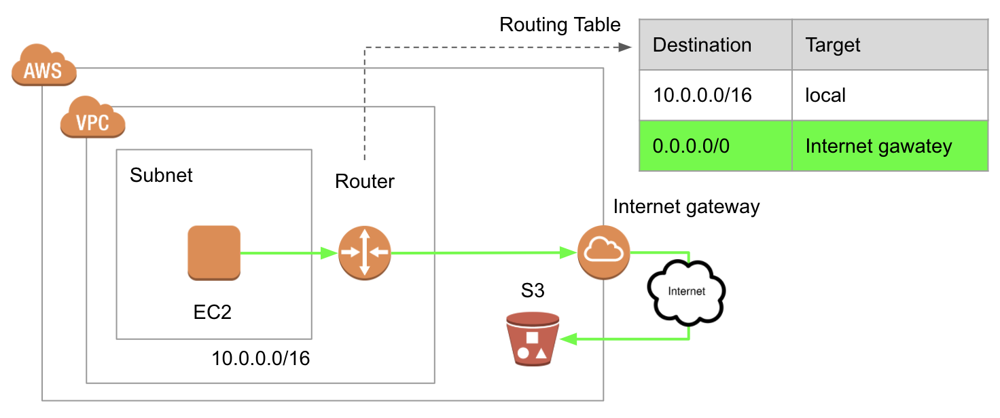
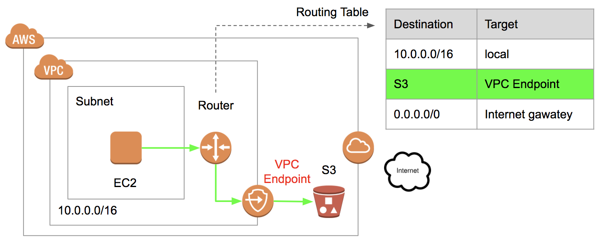
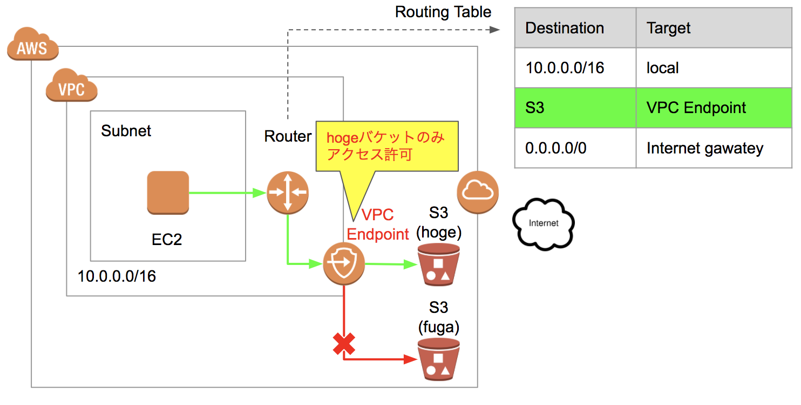
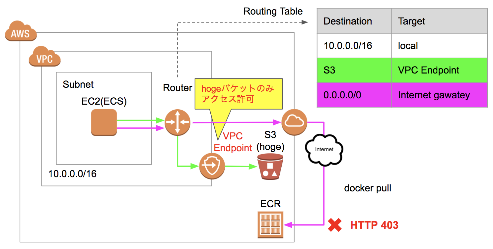
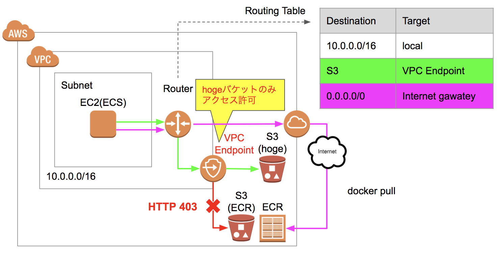
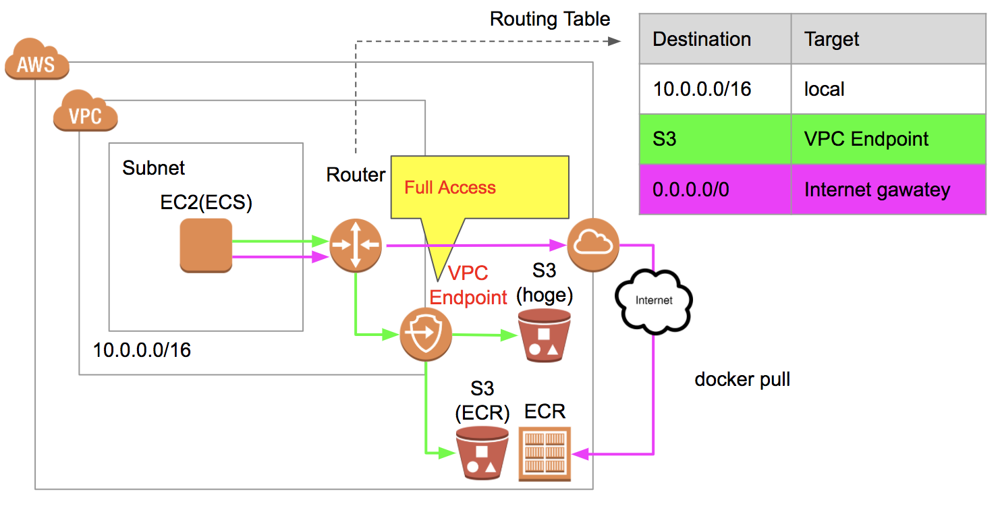

---

## VPCエンドポイントとECRで大爆発した件

#### 2017/12/15 LT
##### 細羽啓司

---

## 何が起きたか？

* とあるプログラムをECSのDockerで動かそうとしていた
* が、ECRからDockerイメージをpull出来ない

---

## ECSのログ

```
error parsing HTTP 403 response body: invalid character
 '<' looking for beginning of value: "<?xml version=\"1.0\" encoding=\"UTF-8\"?>\n
 <Error><Code>AccessDenied</Code><Message>Access Denied</Message>
 <RequestId>XXXXXXXXXXXX</RequestId><HostId>YYYYYYYYYYYYYY</HostId></Error>"
```

---

## ハマる

* ECR側でアクセス権も付与しているはずなのに何故？
* いったん諦めて、とりあえず素のEC2で動かすことに

---

## 寝かせること1週間

---

## 原因が判明

* VPCエンドポイント(S3)の設定の問題であることが判明
* https://forums.aws.amazon.com/thread.jspa?threadID=245232

---

## VPCエンドポイント(S3)とは？

---

## VPCからS3へのトラフィック

* デフォルトではInternet gatewayを経由する



---

## VPCエンドポイント(S3)

* Internet gatewayを経由しない
* 可用性や帯域幅のメリットを享受できる



---

## アクセス制御も可能

* バケット`hoge`だけにアクセス可、みたいな



---

## 今回の状況

---

## docker pullが失敗

* VPCエンドポイント(S3)を設定、かつ、アクセス制御を設定
* EC2(ECS)からECRへ`docker pull`を実行するも失敗(HTTP 403)

+++



---

## 原因: ECRのバックエンドにS3

* DockerイメージのダウンロードでS3へのアクセスが発生
* `hogeのみアクセス許可`のため、ECRのS3にアクセスできず403

+++



---

## Full Accessにして回避

* ECRのS3バケット名は分からないので...



---

## ご清聴ありがとうございました